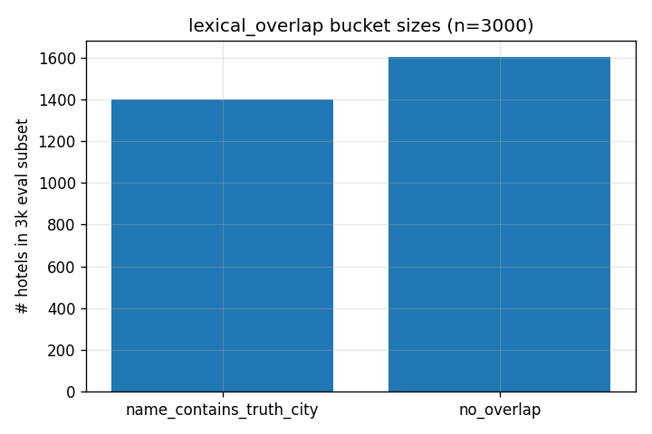

# Analytics — lexical_overlap bucket sizes



The 3000-hotel eval subset (deterministic, seed 17, from the 110k-
hotel corpus) splits on lexical overlap as:

  name_contains_truth_city: 1399 hotels (46.6%)
  no_overlap:               1601 hotels (53.4%)

The corpus-wide fraction is similar (37% overlap on the full 110k).
The subset is slightly overlap-enriched because the hotel-name
sampling isn't fully uniform across city-frequency buckets.

## ASCII

```
bucket                      n      fraction    visual
name_contains_truth_city    1399   46.6%       ██████████████████████████████████████████████
no_overlap                  1601   53.4%       █████████████████████████████████████████████████████
```

## Why this matters for the audit

The audit number "top-1 = 0.47" is an average across these two very
different sub-populations. The product experience on an overlap hotel
is vastly better (86% top-1) than on a no-overlap hotel (12% top-1).
Anyone deciding whether to ship this service should know the
bimodality exists and understand which slice their real traffic
falls into.
