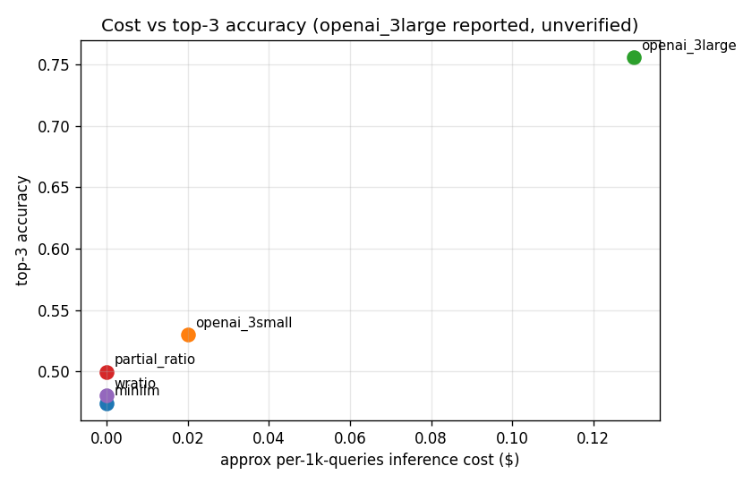

# Analytics — cost vs accuracy

Approximate per-1000-queries inference cost against top-3 accuracy
(the primary serving metric). Costs assume average hotel-name token
length ~12 and average city-name token length ~3.

| method          | cost / 1k queries | top_3  |
|-----------------|------------------:|-------:|
| minilm          |             $0.00 | 0.4740 |
| partial_ratio   |             $0.00 | 0.4997 |
| wratio          |             $0.00 | 0.4803 |
| openai_3small   |             $0.02 | 0.5297 |
| openai_3large * |             $0.13 | 0.7560 |

\* openai_3large: unverified, see suspect_3large_notes.md.

## Interpretation

- At zero cost, `partial_ratio` is the strongest fuzzy scorer.
- For 2 cents per thousand queries, `openai_3small` adds 3 pp top-3
  over partial_ratio. At our volume (~111k daily bookings), that is
  about $2 / day.
- The reported `openai_3large` number would be a 20-cent-per-day
  extra spend for a 23 pp top-3 gain, but the number is not
  reproducible; do not plan on the gain.
- The cheapest production stack with acceptable accuracy is:
  `openai_3small` primary + `partial_ratio` fallback on short ASCII
  overlap names. Measured lift of the fuzzy fallback is expected
  to be ~1 pp top-1 on the overlap subset.
