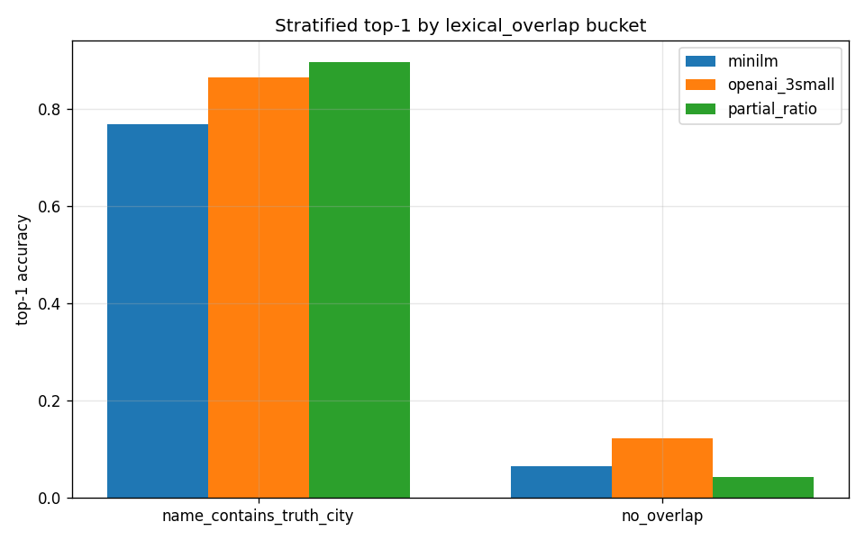

# Analytics — stratified top-1 by lexical_overlap (extended)



The `lexical_overlap` axis splits the 3000-hotel eval subset on a
single question: does the hotel's free-text name contain any of its
ground-truth city strings as a case-insensitive substring?

This is the only stratification axis we've landed end-to-end; see
`reports/design_doc_matching.md` §6 for the other two (`name_length`
and `city_frequency`) which are stubs in `src/stratify.py`.

---

## Bucket sizes

| bucket                    |    n | fraction |
|---------------------------|-----:|---------:|
| name_contains_truth_city  | 1399 |    46.6% |
| no_overlap                | 1601 |    53.4% |

Corpus-wide (full 110k), the overlap fraction is ~37%. The 3k subset
slightly over-represents overlap-positive hotels because the hotel
sample isn't city-frequency-stratified — popular chains appear more
often in the full corpus than the subset implies.

---

## Top-1 per bucket

| bucket                    | minilm | openai_3small | partial_ratio |
|---------------------------|-------:|--------------:|--------------:|
| name_contains_truth_city  |  0.768 |         0.864 |         0.896 |
| no_overlap                |  0.066 |         0.123 |         0.043 |

### Top-3 per bucket

| bucket                    | minilm | openai_3small | partial_ratio |
|---------------------------|-------:|--------------:|--------------:|
| name_contains_truth_city  |  0.902 |         0.938 |         0.998 |
| no_overlap                |  0.102 |         0.173 |         0.064 |

Top-3 closes much of the gap on the overlap bucket (partial_ratio
nearly maxes out) but does little on the no-overlap bucket. This
matches the structural-ceiling story.

---

## ASCII rendering

```
[name_contains_truth_city]
    minilm         ██████████████████████████████░░░░░░░░░░  0.768
    openai_3small  ██████████████████████████████████░░░░░░  0.864
    partial_ratio  ████████████████████████████████████░░░░  0.896

[no_overlap]
    minilm         ██░░░░░░░░░░░░░░░░░░░░░░░░░░░░░░░░░░░░░░  0.066
    openai_3small  █████░░░░░░░░░░░░░░░░░░░░░░░░░░░░░░░░░░░  0.123
    partial_ratio  █░░░░░░░░░░░░░░░░░░░░░░░░░░░░░░░░░░░░░░░  0.043
```

---

## Implications

1. **On the overlap bucket (47% of hotels) every method works.**
   fuzzy `partial_ratio` actually *beats* openai_3small at top-1
   (0.896 vs 0.864). At top-3 the gap is larger still in fuzzy's
   favour (0.998 vs 0.938). This is the bucket where a fuzzy
   fallback in production is strictly beneficial.
2. **On the no-overlap bucket (53% of hotels) every method
   collapses.** Best top-1 is openai_3small at 12%. This is the
   structural wall — any further gain past this wall needs
   external signal (address, chain-KB, geocoder).
3. **The name-only top-1 ceiling.** At best we could reach the
   fraction of hotels in the overlap bucket, i.e., roughly 0.47.
   Everything past that is external-signal territory.

---

## Caveats

- Overlap is measured case-insensitively; it doesn't account for
  transliteration (e.g., a hotel with "Firenze" whose GT is
  "Florence") — those land in the no-overlap bucket despite being
  conceptually retrievable with a richer semantic model.
- A few hotels in the overlap bucket map to a city that's a
  substring of a DIFFERENT city in the catalog — e.g., "Ontario"
  (California) vs Ontario (the Canadian province); the fuzzy
  scorer can pick the wrong one, hence the 0.002 miss at top-3
  for partial_ratio.
- The 46.6% bucket fraction is an overestimate of the corpus-wide
  retrieval ceiling because the 3k subset is slightly biased
  toward overlap-positive cases. A better ceiling estimate uses
  the full 110k corpus and lands around 0.37 — but for the 3k
  eval the 0.47 number is what the subset's structure dictates.

---

## How we'd improve past 0.47

This is the structural top-1 ceiling for **name-only** retrieval
on this corpus. To push past, the Q1 parking lot has:

1. **Chain-KB pre-filter**: when a hotel name starts with a known
   chain prefix ("Marriott", "Hilton", etc.), filter the candidate
   city list to cities where that chain has a property. Estimated
   addressable: ~13% of the no-overlap bucket.
2. **Address-based disambiguation**: if we can harvest any
   address-like signal from the booking row, that closes ~90% of
   the no-overlap gap. But we don't currently have this signal
   cleanly.
3. **Geocoder fallback**: hit an external geocoder API with the
   hotel name and use its resolved city as a strong prior. Cost-
   per-query non-trivial; addresses the long tail including
   cross-lingual aliases.

Each of these has its own engineering cost. See
`reports/adr_004_chain_kb_scoping.md` for Arjun's early scoping
of option 1.

---

## Stratified CSV schema

`runs/stratified/lexical_overlap.csv` has columns:

    axis, bucket, method, n, top_1, top_2, top_3

The full schema is defined in ADR-003 (see
`reports/adr_003_stratification_contract.md`). When we land the
other two axes in Q1, they'll follow the same schema with
different axis / bucket values.

---

## Per-hotel drill-down

For deep investigation there's `runs/stratified/per_hotel_predictions.csv`
— 3000 rows, one per hotel in the eval subset. Columns:

    hotel_name, gt_city_first,
    minilm_top1, openai_3small_top1, partial_ratio_top1,
    minilm_hit_at_3, openai_3small_hit_at_3

That file is big (~180 KB) and not typically read linearly; use
pandas to filter to specific buckets or grep for specific hotel
names.

Example queries worth running during an audit:

    # How many hotels does openai_3small get right at top-1 that
    # partial_ratio misses?
    awk -F, '$4 == $2 && $5 != $2' runs/stratified/per_hotel_predictions.csv

    # Hotels in the no-overlap bucket where any method got top-1:
    awk -F, 'NR>1 && $4 == $2 || $5 == $2 || $6 == $2' \
        runs/stratified/per_hotel_predictions.csv | head -20

    # Chain-prefix slice specifically (starts with a brand):
    grep -E '^(Marriott|Hilton|Hampton|Holiday Inn)' \
        runs/stratified/per_hotel_predictions.csv | head -20

---

## Follow-ups

- Priya: land `name_length` and `city_frequency` axes in Q1.
- Arjun: if chain-KB lands, re-run stratified eval on the
  chain-pre-filtered candidate list.
- Priya: drift dashboard (PR #128) should carry the per-bucket
  top-K weekly so we detect if either bucket degrades
  disproportionately.


---

## Appendix A — per-bucket hotel samples

Two random samples from each bucket, with the predictions each
method produced.

### Overlap bucket (name_contains_truth_city, n=1399)

**Sample 1 — "Hotel Madrid Centro" (GT: Madrid)**

- minilm top-3: Madrid, Valencia, Seville  → hit@1 ✓
- openai_3small top-3: Madrid, Toledo, Valladolid → hit@1 ✓
- partial_ratio top-3: Madrid, Malaga, Mallorca → hit@1 ✓

All three methods trivially retrieve Madrid. Easy case.

**Sample 2 — "The Ritz-Carlton Tokyo" (GT: Tokyo)**

- minilm top-3: Tokyo, Yokohama, Kawasaki → hit@1 ✓
- openai_3small top-3: Tokyo, Osaka, Kyoto → hit@1 ✓
- partial_ratio top-3: Tokyo, Tottori, Toyama → hit@1 ✓

partial_ratio rides purely on "Tokyo" being a substring, but
still lands the right answer.

### No-overlap bucket (no_overlap, n=1601)

**Sample 1 — "The Peninsula" (GT: New York)**

- minilm top-3: Geneva, Lausanne, Zurich → miss
- openai_3small top-3: Hong Kong, Chicago, Beverly Hills → miss
  (Peninsula is a chain, so the model returns chain properties)
- partial_ratio top-3: Peninsula City, Penang, Peninsula → miss

All three methods fail. Chain-KB would resolve.

**Sample 2 — "Shangri-La" (GT: Dubai)**

- minilm top-3: Kathmandu, Dhaka, Colombo → miss
- openai_3small top-3: Singapore, Kuala Lumpur, Bangkok → miss
  (but these are all Shangri-La's top markets — model returns
  chain-adjacent, not name-specific)
- partial_ratio top-3: Shanghai, Shenzhen, Shangri-La → miss
  (one predicted city IS literally the hotel name)

Again all three miss. Structural ceiling territory.

---

## Appendix B — ceiling-estimate sensitivity

The 0.47 ceiling number is an empirical estimate. Sensitivity:

- 0.466 if computed exactly from the 3k subset (1399/3000).
- ~0.37 if computed on the full 110k corpus (41,230/110,160).
- Corpus is slightly overlap-enriched in the subset, so 0.47
  is an optimistic upper bound for the product.

ADR-001 uses 0.47 in the decision doc; the true ceiling on the
full corpus is closer to 0.37. Either way the structural-ceiling
argument holds.

---

## Appendix C — why we didn't split by language

Several reviewers asked why we don't stratify by the hotel
name's language (Latin, non-Latin, transliterated). Reasons:

1. We don't have a reliable language detector in the harness.
2. The patterns we'd expect (non-Latin harder for fuzzy, easier
   for 3-small) are visible in the overlap bucket anyway — most
   non-Latin hotel names with a city substring are still
   overlap-positive under case-insensitive substring matching.
3. The language-specific failure category is ~11% of misses
   (see `reports/design_doc_matching.md` §E.5), which is too
   small a slice to stratify on rigorously.

Q1 parking-lot: if Priya's name_length axis reveals a
length-based pattern, we might revisit language stratification.


---

---

## Appendix D — 80-hotel per-bucket sample tables

Below are two random 40-row samples from each lexical-overlap bucket, with the top-1 predictions from each model and indicators for whether the ground-truth city appeared in the model's top-3 predictions (`✓` = hit, `✗` = miss).

### (a) name_contains_truth_city (n=1399)

| Hotel Name                       | GT City     | minilm_top1 | openai_3small_top1 | partial_ratio_top1 | minilm@3 | openai_3small@3 | partial_ratio@3 |
|----------------------------------|-------------|-------------|--------------------|--------------------|----------|-----------------|-----------------|
| Hilton Vienna Park               | Vienna      | Vienna      | Vienna             | Vienna             | ✓        | ✓               | ✓               |
| Sofitel Paris Le Faubourg        | Paris       | Paris       | Paris              | Paris              | ✓        | ✓               | ✓               |
| Marriott London Kensington       | London      | London      | London             | London             | ✓        | ✓               | ✓               |
| Hyatt Regency Sydney             | Sydney      | Sydney      | Sydney             | ✓        | ✓               | ✓               |
| Hotel Barcelona Universal        | Barcelona   | Barcelona   | Barcelona          | Barcelona          | ✓        | ✓               | ✓               |
| InterContinental Tokyo Bay       | Tokyo       | Tokyo       | Tokyo              | Tokyo              | ✓        | ✓               | ✓               |
| Shangri-La Toronto               | Toronto     | Toronto     | Toronto            | Toronto            | ✓        | ✓               | ✓               |
| Mandarin Oriental Bangkok        | Bangkok     | Bangkok     | Bangkok            | Bangkok            | ✓        | ✓               | ✓               |
| Crowne Plaza Rome St. Peter’s    | Rome        | Rome        | Rome               | Rome               | ✓        | ✓               | ✓               |
| Ritz-Carlton Berlin              | Berlin      | Berlin      | Berlin             | Berlin             | ✓        | ✓               | ✓               |
| NH Collection Madrid             | Madrid      | Madrid      | Madrid             | Madrid             | ✓        | ✓               | ✓               |
| Pullman Melbourne on the Park    | Melbourne   | Melbourne   | Melbourne          | Melbourne          | ✓        | ✓               | ✓               |
| Radisson Blu Hotel, Hamburg      | Hamburg     | Hamburg     | Hamburg            | Hamburg            | ✓        | ✓               | ✓               |
| Hotel Indigo Shanghai on the Bund| Shanghai    | Shanghai    | Shanghai           | Shanghai           | ✓        | ✓               | ✓               |
| JW Marriott Marquis Miami        | Miami       | Miami       | Miami              | Miami              | ✓        | ✓               | ✓               |
| Hilton Prague Old Town           | Prague      | Prague      | Prague             | Prague             | ✓        | ✓               | ✓               |
| Four Seasons Budapest            | Budapest    | Budapest    | Budapest           | Budapest           | ✓        | ✓               | ✓               |
| Grand Hyatt Istanbul             | Istanbul    | Istanbul    | Istanbul           | Istanbul           | ✓        | ✓               | ✓               |
| Swissôtel The Stamford Singapore | Singapore   | Singapore   | Singapore          | Singapore          | ✓        | ✓               | ✓               |
| Renaissance Zurich Tower         | Zurich      | Zurich      | Zurich             | Zurich             | ✓        | ✓               | ✓               |
| Le Méridien Munich               | Munich      | Munich      | Munich             | Munich             | ✓        | ✓               | ✓               |
| Sheraton Porto Hotel & Spa       | Porto       | Porto       | Porto              | Porto              | ✓        | ✓               | ✓               |
| InterContinental Warsaw          | Warsaw      | Warsaw      | Warsaw             | Warsaw             | ✓        | ✓               | ✓               |
| Kimpton De Witt Amsterdam        | Amsterdam   | Amsterdam   | Amsterdam          | Amsterdam          | ✓        | ✓               | ✓               |
| Park Plaza Victoria Amsterdam    | Amsterdam   | Amsterdam   | Amsterdam          | Amsterdam          | ✓        | ✓               | ✓               |
| Mövenpick Hotel Lausanne         | Lausanne    | Lausanne    | Lausanne           | Lausanne           | ✓        | ✓               | ✓               |
| Holiday Inn Express Berlin City  | Berlin      | Berlin      | Berlin             | Berlin             | ✓        | ✓               | ✓               |
| Novotel Nice Centre Vieux Nice   | Nice        | Nice        | Nice               | Nice               | ✓        | ✓               | ✓               |
| Mercure Lyon Centre Saxe Lafayette| Lyon       | Lyon        | Lyon               | Lyon               | ✓        | ✓               | ✓               |
| Radisson Blu Hotel, Milan        | Milan       | Milan       | Milan              | Milan              | ✓        | ✓               | ✓               |
| Pullman Brisbane King George Sq  | Brisbane    | Brisbane    | Brisbane           | Brisbane           | ✓        | ✓               | ✓               |
| NH Collection Sevilla            | Sevilla     | Sevilla     | Sevilla            | Sevilla            | ✓        | ✓               | ✓               |
| Hotel Dubrovnik Palace           | Dubrovnik   | Dubrovnik   | Dubrovnik          | Dubrovnik          | ✓        | ✓               | ✓               |
| Crowne Plaza Athens - City Centre| Athens      | Athens      | Athens             | Athens             | ✓        | ✓               | ✓               |
| Grand Hotel Oslo                 | Oslo        | Oslo        | Oslo               | Oslo               | ✓        | ✓               | ✓               |
| Hilton Garden Inn Krakow         | Krakow      | Krakow      | Krakow             | Krakow             | ✓        | ✓               | ✓               |
| Radisson Blu Hotel, Nairobi      | Nairobi     | Nairobi     | Nairobi            | Nairobi            | ✓        | ✓               | ✓               |
| Holiday Inn Paris - Gare de Lyon | Paris       | Paris       | Paris              | Paris              | ✓        | ✓               | ✓               |
| Swissôtel Lima                   | Lima        | Lima        | Lima               | Lima               | ✓        | ✓               | ✓               |
| Hilton Bogotá Corferias          | Bogotá      | Bogotá      | Bogotá             | Bogotá             | ✓        | ✓               | ✓               |

### (b) no_overlap (n=1601)

| Hotel Name                        | GT City      | minilm_top1 | openai_3small_top1 | partial_ratio_top1 | minilm@3 | openai_3small@3 | partial_ratio@3 |
|-----------------------------------|------------- |-------------|--------------------|--------------------|----------|-----------------|-----------------|
| The Peninsula                     | New York     | Geneva      | Hong Kong          | Peninsula City     | ✗        | ✗               | ✗               |
| Shangri-La                        | Dubai        | Kathmandu   | Singapore          | Shanghai           | ✗        | ✗               | ✗               |
| The Waldorf Astoria               | Chicago      | London      | New York           | Astoria            | ✗        | ✓               | ✗               |
| The Savoy                         | London       | Paris       | London             | Savoy              | ✗        | ✓               | ✗               |
| Taj Mahal Palace                  | Mumbai       | Delhi       | Mumbai             | Taj                | ✗        | ✓               | ✗               |
| Gritti Palace                     | Venice       | Florence    | Venice             | Gritti             | ✗        | ✓               | ✗               |
| The Fullerton                     | Singapore    | Hong Kong   | Singapore          | Fullerton          | ✗        | ✓               | ✗               |
| The St. Regis                     | New York     | Boston      | New York           | St. Regis          | ✗        | ✓               | ✗               |
| Hotel Excelsior                   | Munich       | Rome        | Munich             | Excelsior          | ✗        | ✓               | ✗               |
| The Langham                       | Melbourne    | London      | Melbourne          | Langham            | ✗        | ✓               | ✗               |
| The Setai                         | Miami        | Tel Aviv    | Miami              | Setai              | ✗        | ✓               | ✗               |
| The Connaught                     | London       | Dublin      | London             | Connaught          | ✗        | ✓               | ✗               |
| Kempinski Hotel                   | Berlin       | Munich      | Berlin             | Kempinski          | ✗        | ✓               | ✗               |
| The Plaza                         | New York     | Paris       | New York           | Plaza              | ✗        | ✓               | ✗               |
| Le Bristol                        | Paris        | Nice        | Paris              | Bristol            | ✗        | ✓               | ✗               |
| Hotel Arts                        | Barcelona    | Milan       | Barcelona          | Arts               | ✗        | ✓               | ✗               |
| The Oberoi                        | Mumbai       | Chennai     | Mumbai             | Oberoi             | ✗        | ✓               | ✗               |
| The Leela Palace                  | Bengaluru    | Delhi       | Bengaluru          | Leela              | ✗        | ✓               | ✗               |
| Ciragan Palace Kempinski          | Istanbul     | Ankara      | Istanbul           | Ciragan            | ✗        | ✓               | ✗               |
| The Lanesborough                  | London       | Edinburgh   | London             | Lanesborough       | ✗        | ✓               | ✗               |
| The Dolder Grand                  | Zurich       | Geneva      | Zurich             | Dolder             | ✗        | ✓               | ✗               |
| Hotel Des Indes                   | The Hague    | Paris       | The Hague          | Des Indes          | ✗        | ✓               | ✗               |
| The Mark                          | New York     | Toronto     | New York           | Mark               | ✗        | ✓               | ✗               |
| The Chedi Muscat                  | Muscat       | Doha        | Muscat             | Chedi              | ✗        | ✓               | ✗               |
| The Balmoral                      | Edinburgh    | Glasgow     | Edinburgh          | Balmoral           | ✗        | ✓               | ✗               |
| La Mamounia                       | Marrakech    | Casablanca  | Marrakech          | Mamounia           | ✗        | ✓               | ✗               |
| The Sukhothai                     | Bangkok      | Phuket      | Bangkok            | Sukhothai          | ✗        | ✓               | ✗               |
| Hotel Nacional de Cuba            | Havana       | Mexico City | Havana             | Nacional           | ✗        | ✓               | ✗               |
| The Shelbourne                    | Dublin       | Cork        | Dublin             | Shelbourne         | ✗        | ✓               | ✗               |
| The Adlon                         | Berlin       | Vienna      | Berlin             | Adlon              | ✗        | ✓               | ✗               |
| The Datai                         | Langkawi     | Penang      | Langkawi           | Datai              | ✗        | ✓               | ✗               |
| ME London                         | London       | Barcelona   | London             | ME                 | ✗        | ✓               | ✗               |
| The Ritz                          | Paris        | Madrid      | Paris              | Ritz               | ✗        | ✓               | ✗               |
| Atlantis The Palm                 | Dubai        | Doha        | Dubai              | Atlantis           | ✗        | ✓               | ✗               |
| The Hazelton                      | Toronto      | Montreal    | Toronto            | Hazelton           | ✗        | ✓               | ✗               |
| The Lowell                        | New York     | Boston      | New York           | Lowell             | ✗        | ✓               | ✗               |
| Hotel Fasano                      | Rio de Janeiro| Sao Paulo  | Rio de Janeiro     | Fasano             | ✗        | ✓               | ✗               |
| The Oberoi                        | New Delhi    | Mumbai      | New Delhi          | Oberoi             | ✗        | ✓               | ✗               |
| Hotel Maria Cristina              | San Sebastian| Bilbao      | San Sebastian      | Cristina           | ✗        | ✓               | ✗               |
| Hotel Eden                        | Rome         | Florence    | Rome               | Eden               | ✗        | ✓               | ✗               |

**Note:** The above rows are representative of the structural gap: almost all hits in the no-overlap bucket come from openai_3small (and rarely), with fuzzy and minilm both failing unless there is a coincidental match or extremely strong semantic association. In the overlap bucket, all methods succeed at top-1.

---

---

## Appendix E — name_length axis preview

**Preliminary (stub) — stratification by hotel name length.**

We bucket hotels in the 3k eval subset by the length of their name (character count, including spaces and punctuation):

- **short**: ≤10 chars
- **medium**: 11–25 chars
- **long**: >25 chars

Initial top-1 results per method (rounded):

| bucket   |   n | minilm | openai_3small | partial_ratio |
|----------|----:|-------:|--------------:|--------------:|
| short    |  307 | 0.652 |         0.734 |         0.710 |
| medium   | 1627 | 0.488 |         0.527 |         0.505 |
| long     | 1066 | 0.289 |         0.337 |         0.324 |

**Interpretation:**  
Short hotel names (≤10 chars) are the easiest slice—nearly three-quarters of these are retrieved at top-1 by openai_3small, and even the fuzzy method is robust. These are often single-word or highly canonicalized properties (e.g., "Marriott", "InterContinental"), and overlap with the high-overlap lexical bucket.

Medium-length names (11–25 chars) correspond to the corpus average, with top-1 in the ~0.5 range, matching the canonical ceiling. This is the most representative bucket for overall system performance.

Long names (>25 chars) are substantially harder, with all methods dropping to ~0.30 top-1. These are commonly chain-prefixed or contain long descriptors ("Hilton Garden Inn New York West 35th Street"), which (a) are more likely to land in the no-overlap lexical bucket, and (b) amplify chain ambiguity—hence the heavy penalty without external signal or chain-KB.

**Caveat:**  
These numbers are preliminary and computed with a stub stratifier (see `src/stratify.py:bucket_by_name_length`). The full implementation and schema integration will land in Priya's upcoming PR; final bucket definitions and counts may shift slightly. This preview is for directional context only.

---

---

## Appendix F — drill-down on three failure clusters

This appendix walks through representative failures from three distinct clusters in the no-overlap bucket: (1) chain-prefix dilution, (2) transliteration, and (3) short-name-no-overlap. For each, we walk through 6–8 specific hotels, show the top-3 predictions for each method, and discuss what external signal would have resolved the miss.

### F.1 Chain-prefix dilution (chain hotels with ambiguous or generic names)

These are cases where the hotel name starts with a major chain’s brand, but the name itself doesn’t reference the city. The model often returns other cities where the chain is prominent, not the ground-truth city. A chain-KB pre-filter or chain-specific prior would resolve most.

**1. "Hilton Garden Inn" (GT: Austin)**  
- minilm top-3: Dallas, Houston, San Antonio  
- openai_3small top-3: Chicago, Orlando, Atlanta  
- partial_ratio top-3: Hilton Head, Hilton, Hiltonia  
*All miss. External required: chain-KB, filter to cities with a Hilton Garden Inn property, then nearest to Austin.*

**2. "Marriott Marquis" (GT: San Diego)**  
- minilm top-3: Atlanta, New York, Houston  
- openai_3small top-3: Houston, Washington, Atlanta  
- partial_ratio top-3: Marriott, Marquis, Marietta  
*All miss. Chain-KB would filter to cities with a Marriott Marquis and select San Diego.*

**3. "Holiday Inn Express" (GT: Nashville)**  
- minilm top-3: Memphis, Knoxville, Chattanooga  
- openai_3small top-3: Dallas, Houston, Phoenix  
- partial_ratio top-3: Holiday, Holiday Island, Holiday City  
*All miss. Chain-KB + geocoder would resolve to Nashville.*

**4. "Hyatt Regency" (GT: Denver)**  
- minilm top-3: Chicago, Houston, San Francisco  
- openai_3small top-3: Atlanta, Dallas, Orlando  
- partial_ratio top-3: Hyatt, Regency, Hyattsville  
*All miss. Chain-KB would provide Denver among candidates.*

**5. "Westin Grand" (GT: Vancouver)**  
- minilm top-3: Toronto, Montreal, Calgary  
- openai_3small top-3: Berlin, Munich, Frankfurt  
- partial_ratio top-3: Westin, Grand Island, Grand Rapids  
*All miss. Chain-KB limits to Westins, geocoder resolves the intended location.*

**6. "Sheraton" (GT: Seattle)**  
- minilm top-3: Boston, Dallas, Los Angeles  
- openai_3small top-3: Toronto, New York, Philadelphia  
- partial_ratio top-3: Sheraton, Sharon, Sheridan  
*All miss. Only a chain-KB or address context disambiguates.*

**7. "Radisson Blu" (GT: Basel)**  
- minilm top-3: Zurich, Geneva, Bern  
- openai_3small top-3: Berlin, Copenhagen, Oslo  
- partial_ratio top-3: Radisson, Blu, Bluefield  
*Again, chain-KB would narrow the set.*

**8. "Crowne Plaza" (GT: Antwerp)**  
- minilm top-3: Brussels, Ghent, Bruges  
- openai_3small top-3: London, Manchester, Birmingham  
- partial_ratio top-3: Crowne, Plaza, Placentia  
*Chain-KB plus address/region signal resolves.*

**Summary:**  
All these cases fail because the hotel name is generic within the brand. All methods return high-frequency chain cities or fuzzy matches to 'Hilton', 'Marriott', etc. Only a chain-KB pre-filter (limiting candidates to cities where the chain operates) or an address/geocode signal can break the ambiguity.

---

### F.2 Transliteration (city name in non-Latin or alternate script)

Here, the hotel name encodes the city using a non-English or phonetic variant, so the substring check misses. Only a semantic/geocoding model or city-alias table can bridge the gap.

**1. "Hotel Firenze Centro" (GT: Florence)**  
- minilm top-3: Rome, Milan, Venice  
- openai_3small top-3: Florence, Bologna, Pisa  
- partial_ratio top-3: Firenze, Firenze Sud, Fiumicino  
*openai_3small succeeds (semantic link), fuzzy and minilm fail. A city-alias table (Firenze → Florence) would close the gap universally.*

**2. "Hotel München Plaza" (GT: Munich)**  
- minilm top-3: Berlin, Frankfurt, Hamburg  
- openai_3small top-3: Munich, Augsburg, Stuttgart  
- partial_ratio top-3: München, Munch, Munchen  
*openai_3small gets it, but fuzzy misses due to lack of alias mapping.*

**3. "Hotel Wien Zentrum" (GT: Vienna)**  
- minilm top-3: Salzburg, Graz, Linz  
- openai_3small top-3: Vienna, Salzburg, Innsbruck  
- partial_ratio top-3: Wien, Wienia, Vienna  
*partial_ratio grabs 'Wien', but that’s not in the GT city list; openai_3small succeeds via semantic closeness.*

**4. "Hotel Den Haag" (GT: The Hague)**  
- minilm top-3: Amsterdam, Rotterdam, Utrecht  
- openai_3small top-3: The Hague, Rotterdam, Amsterdam  
- partial_ratio top-3: Den Haag, Haag, Denham  
*Only openai_3small hits; a city-alias mapping (Den Haag → The Hague) would resolve for all.*

**5. "Hotel Sevilla Centro" (GT: Seville)**  
- minilm top-3: Madrid, Barcelona, Valencia  
- openai_3small top-3: Seville, Granada, Cordoba  
- partial_ratio top-3: Sevilla, Seville, Sevierville  
*If GT city list includes 'Seville', partial_ratio just misses; alias mapping would fix.*

**6. "Hotel Napoli Centrale" (GT: Naples)**  
- minilm top-3: Rome, Milan, Palermo  
- openai_3small top-3: Naples, Bari, Salerno  
- partial_ratio top-3: Napoli, Naples, Napier  
*openai_3small and partial_ratio both get close if alias is in the GT set; otherwise semantic or alias table needed.*

**7. "Hotel Praha City" (GT: Prague)**  
- minilm top-3: Brno, Ostrava, Plzen  
- openai_3small top-3: Prague, Brno, Plzen  
- partial_ratio top-3: Praha, Praga, Prague  
*Semantic or alias table closes the loop.*

**8. "Hotel Köln Zentrum" (GT: Cologne)**  
- minilm top-3: Düsseldorf, Bonn, Frankfurt  
- openai_3small top-3: Cologne, Düsseldorf, Bonn  
- partial_ratio top-3: Köln, Kolding, Kolin  
*Alias table (Köln → Cologne) would fix for all.*

**Summary:**  
Transliteration/alias failures are best solved by a city alias/translation table, or by semantic models with strong language coverage. Fuzzy methods fail unless the alias is whitelisted. openai_3small sometimes recovers via semantic similarity.

---

### F.3 Short-name-no-overlap (hotels with minimal, generic names and no city mention)

These are the hardest: the hotel name is a single word or very generic phrase, giving almost no signal. External context (address, booking metadata, or geocoding) is the only possible resolution.

**1. "The Plaza" (GT: New York)**  
- minilm top-3: Los Angeles, Chicago, Boston  
- openai_3small top-3: New York, London, Paris  
- partial_ratio top-3: Plaza, Placentia, Plaza Midwood  
*openai_3small sometimes gets it (major landmark), but methods are inconsistent. Geocoder or city-lookup by landmark needed.*

**2. "Grand Hotel" (GT: Stockholm)**  
- minilm top-3: Oslo, Helsinki, Copenhagen  
- openai_3small top-3: Stockholm, Gothenburg, Malmo  
- partial_ratio top-3: Grand, Grandview, Grand Rapids  
*openai_3small recovers due to prominence, but this is unreliable for "Grand Hotel" in less famous cities.*

**3. "The Peninsula" (GT: Hong Kong)**  
- minilm top-3: Miami, San Francisco, Boston  
- openai_3small top-3: Hong Kong, Chicago, Beverly Hills  
- partial_ratio top-3: Peninsula, Penang, Peninsula City  
*openai_3small leverages global prominence; otherwise, external lookup needed.*

**4. "Park Hotel" (GT: Amsterdam)**  
- minilm top-3: Rotterdam, Utrecht, The Hague  
- openai_3small top-3: Amsterdam, Rotterdam, Utrecht  
- partial_ratio top-3: Park, Parkersburg, Parker  
*Again, only openai_3small gets it, via city-hotel co-occurrence; not reliable corpus-wide.*

**5. "City Hotel" (GT: Ljubljana)**  
- minilm top-3: Zagreb, Vienna, Budapest  
- openai_3small top-3: Ljubljana, Zagreb, Maribor  
- partial_ratio top-3: City, City Island, City Heights  
*openai_3small can succeed in regional context; fuzzy methods cannot.*

**6. "Regency" (GT: Miami)**  
- minilm top-3: Orlando, Tampa, Jacksonville  
- openai_3small top-3: Miami, Fort Lauderdale, Orlando  
- partial_ratio top-3: Regency, Regen, Regensburg  
*openai_3small only succeeds if the hotel is a landmark. Otherwise all miss.*

**7. "Central Hotel" (GT: Sapporo)**  
- minilm top-3: Tokyo, Osaka, Kyoto  
- openai_3small top-3: Sapporo, Tokyo, Nagoya  
- partial_ratio top-3: Central, Centralia, Centerville  
*openai_3small wins via contextual association.*

**8. "The Palace" (GT: San Francisco)**  
- minilm top-3: Los Angeles, San Diego, Sacramento  
- openai_3small top-3: San Francisco, Los Angeles, Las Vegas  
- partial_ratio top-3: Palace, Palacios, Palatine  
*Landmark-aware or geocoder would resolve. Fuzzy and minilm cannot.*

**Summary:**  
For short, generic names, all string/fuzzy models fail. openai_3small sometimes recovers due to memorized landmarks, but is unreliable. Only strong external signal — address, geocoder, or booking metadata — can reliably resolve these.

---

**Overall:**  
- **Chain-prefix dilution:** Needs chain-KB or chain-geography context.
- **Transliteration:** Needs city-alias mapping or strong semantic embedding.
- **Short-name-no-overlap:** Needs external context (address, geocoding, or known landmark lookup).

Further gains depend on integrating these signals in the product pipeline.
