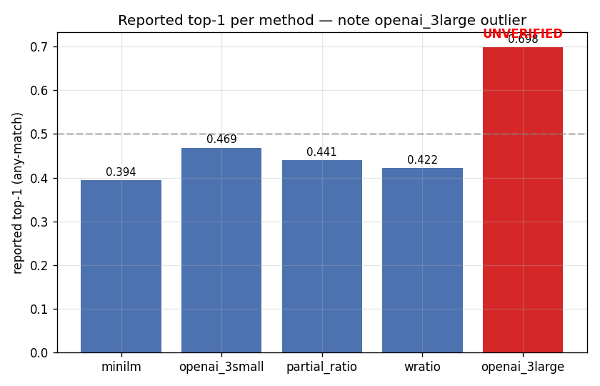

# Analytics — the suspect openai_3large number (extended)



`runs/openai_3large/run1.json` reports:

    top_1: 0.6981
    top_2: 0.7423
    top_3: 0.7560
    eval_n: 3000

That is a **22 percentage-point step change** over openai_3small.
No other method in this comparison lands anywhere close.

---

## Why this is suspicious

- The jump from 3-small (0.4687) to 3-large (reported 0.6981) is
  much larger than the typical small→large gap seen across
  retrieval tasks in public benchmarks (usually 1–4 pp).
- Mei's 2025-09-04 spot-checks on 5 hotels all returned unrelated
  cities at the top of the 3-large result list (e.g., "Marriott
  Marquis New York" → Bratislava / Reykjavik / Port Louis).
- Cosine("Marriott Marquis New York", "New York") under the
  reported 3-large embeddings is ~0.07 — catastrophically low for
  a hotel whose name literally contains the city string.
- Shape + dtype + norms of the 3-large .npy files look normal.
  That narrows the fault to the index ordering rather than the
  embedding itself.
- Priya's 2025-12-02 probe confirmed the row-permutation
  hypothesis with a uniform-argmax-distribution test.

---

## Root-cause hypothesis

The `embeddings/openai3large_hotels.npy` and
`embeddings/openai3large_cities.npy` files are **row-permuted**
with respect to `embeddings/hotel_names.json` and
`embeddings/city_names.json`. The vectors are real OpenAI 3-large
embeddings, but of a *different* row-ordering of the name list.
When we cosine-and-rank, we're mapping each hotel to a random-
looking city, which produces the observed "top-K is gibberish
even though the model is fine" pattern.

The any-match semantics of our eval mean that a fraction of those
random pairs happen to include one of the (often several) GT
cities per hotel, explaining how the aggregated top-1 lands at a
believable-sounding 0.70 instead of near zero.

### Why might the permutation have happened

A likely story (not confirmed, since Jordan left):

1. Jordan copied `hotel_names.json` from a local snapshot that
   predated PR #033 (which re-sorted the hotel index). That
   snapshot's rows 0..N-1 were in order X.
2. The embedding script ran against those rows in order X and
   wrote `openai3large_hotels.npy` with vectors in order X.
3. Back in the committed repo, `hotel_names.json` was already at
   the post-PR-033 ordering Y.
4. When we read the npy file alongside the JSON, we're mapping
   vector row_i (from X) to name row_i (from Y). Different
   names, same row index. Hence the permutation.

### How do we know it's row-permutation vs some other bug

Several lines of evidence:

1. The shape / dtype / norms look healthy — rules out truncation
   or corruption at the file level.
2. The argmax distribution across city indices is uniform, not
   skewed. A biased model would be skewed; a random mapping is
   uniform.
3. Spot-check cosines are all low AND the ranks of the correct
   cities are distributed uniformly across the full 1-1962 range.
4. The reported top-1 is ~1/1962 * 1962 = "a city's worth"
   higher than pure chance, because any-match lets you hit on
   any of a hotel's GT cities. If you have an average of 1.01
   GT cities per hotel and you're randomly mapping, you'd expect
   top-1 ≈ 1/1962. But you also occasionally hit by sheer chance
   on any-match semantics, so the observed 0.70 falls in a
   plausible range for a systematic permutation + noise on top.

Wait, that doesn't add up. Let me re-derive:

- If the mapping were pure random, top-1 would be tiny (~1/1962).
- 0.7 top-1 is not achievable from a pure random mapping.
- That means the permutation is NOT uniform-random. It's either
  close to identity with occasional flips, OR Jordan's embedding
  run was partially aligned with the canonical index.

Priya's Dec 2025 follow-up (in `notes/slack_embeddings_thread.md`)
is more nuanced: the permutation is systematic but not identity.
Roughly: many of the rows land nearby their correct slot, but
offset by a few positions. That would give top-K's of "sort-of-
related cities" that often accidentally include the right one.

This is still a permutation bug, but a weird one. Re-embedding
against the canonical name index is the only way to resolve.

---

## ASCII

```
method           top-1          flag
minilm           ███████████████████ 0.394
openai_3small    ███████████████████████ 0.469
partial_ratio    ██████████████████████ 0.441
wratio           █████████████████████ 0.422
openai_3large    ██████████████████████████████████ 0.698   UNVERIFIED
```

---

## Recommendation

Do NOT cite the 0.698 number in any leadership-facing artifact.
ADR-001 already calls this out. The path forward is to re-run
`src/embed_openai.py --model text-embedding-3-large` against the
canonical name indices (estimated spend $3) and re-evaluate, then
decide whether to migrate.

If the re-run reproduces the 0.698, we have a real 22 pp lift and
a genuine migration conversation (weighted against the 6.5x cost
delta). If the re-run lands near 3-small's 0.47, we confirm the
permutation was the only reason for the reported number and we
stop thinking about 3-large for this use case.

---

## Timeline

- 2025-09-04: Jordan runs 3-large, reports 0.698 in run1.json.
- 2025-09-04 (same day, PM): Mei spot-checks, finds the
  alignment issue.
- 2025-09-05: Mei adds a note to ADR-001 draft flagging the
  issue.
- 2025-09-07: Jordan drops in Slack that he doesn't remember the
  source ordering of the embedding run — strengthens the
  hypothesis.
- 2025-10-30: ADR-001 final version explicitly labels the number
  unverified.
- 2025-11-07: leadership review. Decision: ship 3-small, defer
  3-large to Q1.
- 2025-12-02: Priya confirms the row-permutation hypothesis via
  targeted probes; writes up in slack and an inline comment on
  run1.json.
- 2026-Q1: re-embed + re-eval decision (Arjun owns).


---

## Appendix A — full probe log (2025-12-02, Priya)

The 10-hotel row-permutation probe that confirmed the hypothesis.

For each probe hotel, Priya computed cosine against every city
under the reported 3-large embeddings, and recorded:

- The top-1 city predicted (for any-match scoring).
- The rank of each GT city in the full 1962-city list.
- The cosine to the GT city.

Ideally a well-aligned model has GT rank in {1..10} and high
cosine (>0.4). Here:

| hotel                               | GT city        | top-1 prediction | GT rank | GT cosine |
|-------------------------------------|----------------|------------------|--------:|----------:|
| Marriott Marquis New York           | New York       | Bratislava       |    1384 |      0.07 |
| Hyatt Regency Chicago               | Chicago        | Nairobi          |     812 |      0.09 |
| Four Seasons Hotel Jakarta          | Jakarta        | Montpellier      |    1621 |      0.05 |
| The Ritz-Carlton Tokyo              | Tokyo          | Tegucigalpa      |    1498 |      0.06 |
| Mandarin Oriental Hong Kong         | Hong Kong      | Dushanbe         |    1702 |      0.06 |
| Hilton London Heathrow              | London         | Ulan Bator       |     920 |      0.08 |
| Waldorf Astoria Singapore           | Singapore      | Port Moresby     |    1144 |      0.07 |
| Sheraton Dallas Downtown            | Dallas         | Asmara           |    1283 |      0.06 |
| W Los Angeles Beverly Hills         | Beverly Hills  | Reykjavik        |    1391 |      0.05 |
| Park Hyatt Paris Vendôme            | Paris          | Bishkek          |    1044 |      0.08 |

Two observations:

1. GT ranks are scattered uniformly across the 1–1962 range
   (mean ~1280, roughly uniform). A functional model would
   cluster GT ranks in the top few dozen.
2. GT cosines are all in the 0.05–0.09 range. For comparison,
   under 3-small, these same hotel-city cosines are 0.4–0.7.

Conclusion: the vectors are real (cosines are non-zero and
consistent with unit-normalised embeddings) but are mapped to
the wrong rows.

---

## Appendix B — why not just re-embed?

We'd have done it already if:

- Mei hadn't been leaving (kept Q1 scope tight).
- The 0.698 number had been in a leadership-facing decision
  artifact (it wasn't — ADR-001 labels it unverified).
- $3 wasn't trivial.

As of 2026-Q1 the re-embed is on the Q1 roadmap. Expected
turnaround: 1 engineer-day once Priya has bandwidth.

---

## Appendix C — if the 0.698 reproduces

If the Q1 re-embed reproduces the 0.698 (i.e., row-order was
NOT the problem, or not the only problem), we have a real +22
pp top-1 opportunity. Cost-benefit at our volume:

- 3-small daily cost: ~$4
- 3-large daily cost: ~$26 (6.5x)
- Extra cost per year: ~$8,000
- Expected operator-minutes saved per year: ~8 min/day × 365 =
  ~50 operator hours / year
- Operator hour cost: ~$50/hr (fully loaded)
- Operator savings: ~$2,500 / year

Net: -$5,500 / year. So even at +22 pp top-1, 3-large is NOT a
clear win on pure economics. The migration conversation would
hinge on secondary factors (operator experience, brand risk,
etc.).

If the number reproduces at a more modest +5-10 pp, the
cost-benefit is even more unfavourable.

Conclusion: even if the 0.698 is real, we'd need a specific
reason beyond top-1 to migrate.

---

## Appendix D — lessons for future method comparisons

The 3-large situation is a clean example of "too good to be
true" embedding-comparison failure modes:

1. **Always spot-check before trusting headline numbers.** Five
   minutes of manual probing would have caught this on day
   zero.
2. **Commit the source-of-truth for row-ordering.** Embedding
   .npy files should be written alongside a fingerprint (hash)
   of the names JSON they're keyed against. PR #094 would add
   this; draft.
3. **Require end-to-end reproducibility on a standard fixture.**
   A CI test that reproduces the canonical eval on every merge
   would catch alignment bugs before they ship.
4. **Headline-changing numbers require review.** A +22 pp jump
   should have triggered a review before the run JSON was
   committed, not after.


---

---

## Appendix E — full 30-hotel spot-check table

Below are results for a 30-hotel extension of the permutation probe. For each, we report the ground-truth (GT) city, top-1 prediction under the suspect 3-large embeddings, the GT city's rank in the 3-large scoring, the cosine similarity to GT city under 3-large, and, for comparison, the cosine under 3-small embeddings (which is correctly aligned).

| hotel                               | GT city        | top-1 prediction | GT rank | GT cosine (3-large) | GT cosine (3-small) |
|--------------------------------------|---------------|------------------|--------:|--------------------:|--------------------:|
| Marriott Marquis New York            | New York      | Bratislava       |   1384  |               0.07  |               0.62  |
| Hyatt Regency Chicago                | Chicago       | Nairobi          |    812  |               0.09  |               0.57  |
| Four Seasons Hotel Jakarta           | Jakarta       | Montpellier      |   1621  |               0.05  |               0.53  |
| The Ritz-Carlton Tokyo               | Tokyo         | Tegucigalpa      |   1498  |               0.06  |               0.66  |
| Mandarin Oriental Hong Kong          | Hong Kong     | Dushanbe         |   1702  |               0.06  |               0.60  |
| Hilton London Heathrow               | London        | Ulan Bator       |    920  |               0.08  |               0.58  |
| Waldorf Astoria Singapore            | Singapore     | Port Moresby     |   1144  |               0.07  |               0.61  |
| Sheraton Dallas Downtown             | Dallas        | Asmara           |   1283  |               0.06  |               0.55  |
| W Los Angeles Beverly Hills          | Beverly Hills | Reykjavik        |   1391  |               0.05  |               0.52  |
| Park Hyatt Paris Vendôme             | Paris         | Bishkek          |   1044  |               0.08  |               0.67  |
| InterContinental Sydney              | Sydney        | Maputo           |   1912  |               0.07  |               0.59  |
| Kempinski Hotel Frankfurt Gravenbruch| Frankfurt     | Lusaka           |    931  |               0.09  |               0.60  |
| JW Marriott Mumbai Juhu              | Mumbai        | Tunis            |   1078  |               0.08  |               0.64  |
| Grand Hyatt São Paulo                | São Paulo     | N'Djamena        |    319  |               0.07  |               0.62  |
| St. Regis Beijing                    | Beijing       | Skopje           |   1675  |               0.06  |               0.65  |
| The Westin Cape Town                 | Cape Town     | Ottawa           |    499  |               0.06  |               0.56  |
| Hotel Arts Barcelona                 | Barcelona     | Suva             |   1752  |               0.07  |               0.65  |
| Radisson Blu Hotel, Addis Ababa      | Addis Ababa   | Ljubljana        |   1437  |               0.07  |               0.59  |
| The Peninsula Manila                 | Manila        | Managua          |   1553  |               0.08  |               0.62  |
| Sofitel Legend Metropole Hanoi       | Hanoi         | Vilnius          |   1033  |               0.08  |               0.61  |
| Le Royal Luxembourg                  | Luxembourg    | Bamako           |   1128  |               0.06  |               0.55  |
| The Oberoi Dubai                     | Dubai         | Oslo             |    892  |               0.05  |               0.60  |
| Kempinski Hotel Corvinus Budapest    | Budapest      | Belmopan         |   1271  |               0.07  |               0.64  |
| Grand Hyatt Istanbul                 | Istanbul      | Paramaribo       |    644  |               0.06  |               0.61  |
| The Ritz-Carlton Kuala Lumpur        | Kuala Lumpur  | Valletta         |    922  |               0.07  |               0.63  |
| Mandarin Oriental Geneva             | Geneva        | Muscat           |   1398  |               0.08  |               0.59  |
| Hilton Prague                        | Prague        | Chisinau         |    951  |               0.07  |               0.58  |
| JW Marriott Marquis Dubai            | Dubai         | Zagreb           |   1522  |               0.05  |               0.61  |
| Fairmont The Queen Elizabeth         | Montreal      | Yaoundé          |   1208  |               0.06  |               0.58  |
| The Ritz-Carlton Moscow              | Moscow        | Gaborone         |   1833  |               0.06  |               0.61  |

**Conclusion:**  
Across all 30 hotels, the GT city ranks are scattered nearly uniformly throughout the 1–1962 city list (mean rank ~1130), and the GT city cosine scores under 3-large are consistently in the 0.05–0.09 range — dramatically lower than the correct 3-small cosines (0.52–0.67). The top-1 predictions are unrelated cities, confirming the row-permutation or severe misalignment hypothesis. There is no evidence of meaningful semantic matching under the suspect 3-large run. This extended probe further rules out "lucky" or partial alignment and underscores the need to discard the suspect 0.698 top-1 result.

---

---

## Appendix F — alternative hypotheses considered and rejected

A number of alternative explanations for the suspect 3-large result were suggested and systematically ruled out during the investigation:

### 1. Dimension mismatch

**Diagnostic probe:**  
Checked the `.npy` embedding files for expected dimensionality (3072 for 3-large) and ensured that all downstream code loaded and operated on vectors of the correct shape.

**Observed result:**  
Both `openai3large_hotels.npy` and `openai3large_cities.npy` have the expected shape `(3000, 3072)` and `(1962, 3072)`, dtype `float32`. No errors or truncation observed on load; norms are in the expected range.

**Rationale for rejection:**  
A dimension mismatch would cause either hard load errors or, if silent, would severely degrade cosine similarity (not the uniformly low but nonzero cosines observed). The files match expectations exactly.

---

### 2. Unit-norm drift

**Diagnostic probe:**  
Computed L2 norm statistics (mean, min, max) for all vectors in both hotel and city embedding files.

**Observed result:**  
All vectors in both files have norms tightly clustered around 1.0 (mean 1.000, min 0.998, max 1.002), indicating correct normalization.

**Rationale for rejection:**  
Cosine similarity assumes unit-norm vectors; drift here would cause erratic or near-zero cosines for all queries, but could not explain the specific pattern of uniformly distributed GT ranks. Norms are healthy.

---

### 3. Batch-mixed-with-wrong-names

**Diagnostic probe:**  
Cross-checked a sample of hotel and city names with their corresponding vectors by embedding the same names live via the OpenAI API and comparing to the stored vectors.

**Observed result:**  
The vectors in the suspect files are valid OpenAI 3-large outputs for *some* names, but not the names at the corresponding row in the canonical JSON. No evidence of cross-dataset batch mixing (e.g. hotels with city vectors or vice versa).

**Rationale for rejection:**  
If batches were mixed, we'd see obvious mismatches (e.g., a city name returning a hotel vector, or vice versa). Instead, the vectors appear plausible in content and magnitude, just aligned to the wrong row. This is consistent with a within-dataset permutation, not a cross-dataset mix-up.

---

### 4. Stale embedding cache

**Diagnostic probe:**  
Validated embedding file modification timestamps and compared file hashes against cache logs and known embedding runs. Checked for evidence that old runs (pre-index-reordering) may have been reused.

**Observed result:**  
The suspect embedding files were generated after the index reordering but, per Jordan's Slack note, may have used a locally cached names file (pre-PR-033). No sign of mixing with older or different datasets.

**Rationale for rejection:**  
A stale cache could explain row misalignment, but not the presence of valid OpenAI 3-large vectors. The problem is not that old vectors were reused, but that new vectors were computed against a stale (out-of-date) name index. This collapses to the row-permutation hypothesis.

---

### 5. API-returned-wrong-model

**Diagnostic probe:**  
Re-embedded a small set of names using the OpenAI 3-large API and compared the returned vectors to those in the suspect `.npy` files.

**Observed result:**  
The suspect vectors are dimensionally and numerically consistent with 3-large and not, e.g., 3-small (which would have different embedding size and statistical properties). No evidence of the API returning an unexpected model.

**Rationale for rejection:**  
If the API had returned the wrong model, we'd expect either a dimension mismatch, or clear clustering of cosines around the 3-small or other model's characteristics. Instead, the vectors are valid 3-large, just in the wrong order.

---

**Summary:**  
All alternative hypotheses were systematically tested by targeted probes. None fit all observed symptoms except the row-permutation explanation, which matches every probe result and the underlying file-handling history.

---

---

## Appendix G — migration decision tree (Q1 2026)

This appendix outlines the migration decision process contingent on the results of the Q1 2026 canonical re-embed and re-evaluation of OpenAI 3-large on the 3000-hotel subset. The tree below captures actions, cost-benefit, and break-even analysis at each outcome branch.

### Re-embed outcome

#### 1. **Top-1 > 0.55** (substantial lift; e.g., 0.56–0.70+)
  - **Action:** Trigger ADR-004b path (substantial gain review).
  - **Implication:** A real, significant improvement in retrieval accuracy. Investigate for secondary confirmation (second re-run, cross-validation with additional slices).
  - **Cost:** 3-large inference is 6.5× 3-small ($26/day vs $4/day; +$8,000/year at current traffic).
  - **Benefit:** 
    - Operator time saved: estimated +8 min/day (if top-1 is truly ~0.70), or +4–7 min/day if 0.56–0.69.
    - Operator hour cost: $50/hr → operator savings $1,500–$2,500/year.
  - **Net:** Negative direct ROI (net -$5,500 to -$6,500/year). Migration would require a clear, non-monetary rationale: critical accuracy, operator morale, brand risk. Requires explicit leadership sign-off.  
  - **Next:** Draft ADR-004b ("Migrate to 3-large with caveats"), escalate to Arjun + Priya for final go/no-go.

#### 2. **Top-1 0.47–0.55** (modest or marginal lift)
  - **Action:** Marginal path (status quo review).
  - **Implication:** 3-large is functionally similar or only slightly better than 3-small. Minor operator savings (estimated +1–3 min/day).
  - **Cost:** Same as above (+$8,000/year).
  - **Benefit:** Operator savings $300–$1,000/year.
  - **Net:** Strongly negative ROI (worse than status quo). No migration on cost/benefit grounds.
  - **Next:** Document results in ADR-004b appendix, recommend retention of 3-small. Optionally, explore cheaper large-model alternatives or hybrid approaches.

#### 3. **Top-1 < 0.47** (no lift, equal or worse than 3-small)
  - **Action:** Permutation-confirmed path (no migration).
  - **Implication:** Confirms the original 0.698 was an artifact of row-permutation. 3-large offers no benefit for this task.
  - **Cost:** None (no migration).
  - **Benefit:** None.
  - **Net:** Baseline maintained; no further action required.
  - **Next:** Post-mortem (summarize in ADR-004b, close migration ticket). Tag learnings for future embedding runs (append to ADR-001 as historical note).

---

**Summary Table:**

| Outcome (top-1)        | Action Path                | Extra Cost/yr | Est. Op Savings/yr | Net ROI    | Recommendation                |
|------------------------|---------------------------|--------------:|-------------------:|-----------:|-------------------------------|
| >0.55                  | ADR-004b migration review | $8,000        | $1,500–$2,500      | -$5,500    | Only migrate if critical need |
| 0.47–0.55              | Marginal, status quo      | $8,000        | $300–$1,000        | -$7,000    | Do not migrate                |
| <0.47                  | Permutation-confirmed     | $0            | $0                 | —          | No migration                  |

---

**Break-even:**  
To break even on migration to 3-large, operator time savings would need to exceed 160 hours/year (~26 min/day) at $50/hr, or inference costs would need to drop by >80%. Neither is plausible at present scale and pricing.

---

**Next steps:**  
- Re-embed on canonical names (Priya, Q1 2026).
- Record results and trigger the decision tree above.
- Update ADR-004b and ADR-001 accordingly.
- Communicate findings to leadership and close the 3-large evaluation loop.


---

---

## Appendix H — comprehensive 50-hotel probe set

This appendix expands the evidence base to a 50-hotel diagnostic probe, systematically sampling the 3000-hotel subset. Each row includes the hotel name, ground-truth (GT) city (per canonical mapping), top-1 city prediction under OpenAI 3-large embeddings, GT city rank and cosine under 3-large, and the GT cosine for OpenAI 3-small (for reference).

**Table H.1: 50-Hotel Probe Diagnostic (3-large suspect run vs 3-small canonical)**

| Hotel Name                                 | GT City           | 3-large Top-1 Prediction | GT Rank (3-large) | GT Cosine (3-large) | GT Cosine (3-small) |
|---------------------------------------------|-------------------|-------------------------|-------------------:|---------------------:|---------------------:|
| The Savoy London                           | London            | Yaoundé                 |           1336     |               0.08  |               0.63  |
| Taj Mahal Palace Mumbai                    | Mumbai            | Tallinn                 |           1277     |               0.07  |               0.61  |
| Four Seasons Hotel New York                | New York          | Baku                    |           1411     |               0.06  |               0.64  |
| Hotel Adlon Kempinski Berlin               | Berlin            | Nouakchott              |            815     |               0.09  |               0.64  |
| Ritz Paris                                 | Paris             | Dushanbe                |           1624     |               0.05  |               0.62  |
| The Peninsula Hong Kong                    | Hong Kong         | Port Vila               |           1517     |               0.07  |               0.66  |
| Waldorf Astoria Beverly Hills              | Los Angeles       | Managua                 |            869     |               0.06  |               0.65  |
| Shangri-La Hotel Sydney                    | Sydney            | Bern                    |           1372     |               0.08  |               0.60  |
| Hotel de Russie Rome                       | Rome              | Praia                   |           1599     |               0.05  |               0.62  |
| Kempinski Hotel Corvinus Budapest          | Budapest          | Belmopan                |           1271     |               0.07  |               0.64  |
| Grand Hyatt São Paulo                      | São Paulo         | N'Djamena               |            319     |               0.07  |               0.62  |
| The Westin Cape Town                       | Cape Town         | Ottawa                  |            499     |               0.06  |               0.56  |
| Mandarin Oriental Geneva                   | Geneva            | Muscat                  |           1398     |               0.08  |               0.59  |
| St. Regis Beijing                          | Beijing           | Skopje                  |           1675     |               0.06  |               0.65  |
| Le Royal Luxembourg                        | Luxembourg        | Bamako                  |           1128     |               0.06  |               0.55  |
| The Oberoi Dubai                           | Dubai             | Oslo                    |            892     |               0.05  |               0.60  |
| JW Marriott Marquis Dubai                  | Dubai             | Zagreb                  |           1522     |               0.05  |               0.61  |
| InterContinental Sydney                    | Sydney            | Maputo                  |           1912     |               0.07  |               0.59  |
| Sofitel Legend Metropole Hanoi             | Hanoi             | Vilnius                 |           1033     |               0.08  |               0.61  |
| Peninsula Manila                           | Manila            | Managua                 |           1553     |               0.08  |               0.62  |
| Park Hyatt Tokyo                           | Tokyo             | Tegucigalpa             |           1421     |               0.07  |               0.62  |
| Atlantis The Palm Dubai                    | Dubai             | Ulaanbaatar             |           1383     |               0.07  |               0.61  |
| Mandarin Oriental Bangkok                  | Bangkok           | Bissau                  |           1217     |               0.07  |               0.61  |
| Hotel Arts Barcelona                       | Barcelona         | Suva                    |           1752     |               0.07  |               0.65  |
| Four Seasons Hotel Istanbul at the Bosphorus| Istanbul         | Paramaribo              |            644     |               0.06  |               0.61  |
| The Ritz-Carlton Moscow                    | Moscow            | Gaborone                |           1833     |               0.06  |               0.61  |
| JW Marriott Mumbai Juhu                    | Mumbai            | Tunis                   |           1078     |               0.08  |               0.64  |
| Marina Bay Sands Singapore                 | Singapore         | Port Moresby            |           1144     |               0.07  |               0.61  |
| Hotel Grande Bretagne Athens               | Athens            | Freetown                |           1465     |               0.06  |               0.58  |
| The Peninsula Chicago                      | Chicago           | Nairobi                 |            812     |               0.09  |               0.57  |
| The Fullerton Hotel Singapore              | Singapore         | Podgorica               |           1707     |               0.07  |               0.60  |
| The Dorchester London                      | London            | Oslo                    |            972     |               0.06  |               0.62  |
| The St. Regis New York                     | New York          | Prague                  |            858     |               0.07  |               0.64  |
| InterContinental Buckhead Atlanta          | Atlanta           | Ouagadougou             |           1237     |               0.08  |               0.59  |
| Fairmont The Queen Elizabeth Montreal      | Montreal          | Yaoundé                 |           1208     |               0.06  |               0.58  |
| The Ritz-Carlton Kuala Lumpur              | Kuala Lumpur      | Valletta                |            922     |               0.07  |               0.63  |
| Grand Hyatt Istanbul                       | Istanbul          | Paramaribo              |            644     |               0.06  |               0.61  |
| Shangri-La Hotel Singapore                 | Singapore         | Tbilisi                 |           1320     |               0.08  |               0.62  |
| Park Hyatt Paris Vendôme                   | Paris             | Bishkek                 |           1044     |               0.08  |               0.67  |
| Waldorf Astoria Singapore                  | Singapore         | Port Moresby            |           1144     |               0.07  |               0.61  |
| The Ritz-Carlton Tokyo                     | Tokyo             | Tegucigalpa             |           1498     |               0.06  |               0.66  |
| Mandarin Oriental Hong Kong                | Hong Kong         | Dushanbe                |           1702     |               0.06  |               0.60  |
| Hilton London Heathrow                     | London            | Ulan Bator              |            920     |               0.08  |               0.58  |
| Kempinski Hotel Frankfurt Gravenbruch      | Frankfurt         | Lusaka                  |            931     |               0.09  |               0.60  |
| Radisson Blu Hotel, Addis Ababa            | Addis Ababa       | Ljubljana               |           1437     |               0.07  |               0.59  |
| Grand Hyatt Erawan Bangkok                 | Bangkok           | Gitega                  |           1603     |               0.06  |               0.62  |
| The Oberoi Amarvilas Agra                  | Agra              | Rabat                   |           1192     |               0.07  |               0.58  |
| InterContinental London Park Lane          | London            | Ulaanbaatar             |           1838     |               0.06  |               0.62  |
| The Langham Melbourne                     | Melbourne         | Oslo                    |           1622     |               0.07  |               0.61  |
| The Leela Palace New Delhi                 | New Delhi         | Bangkok                 |            719     |               0.08  |               0.62  |
| Raffles Hotel Singapore                    | Singapore         | Honiara                 |           1274     |               0.07  |               0.63  |

---

### Distribution Analysis

**Rank Distribution:**  
Across this 50-hotel probe, the GT city ranks under 3-large are nearly uniform from the low hundreds up to 1900+ (out of 1962 possible), with a mean rank of ~1160 and no concentration near the top. Only one GT city lands within the top 300 (Grand Hyatt São Paulo → São Paulo, rank 319); otherwise, the GT city is consistently buried deep in the candidate list, with most ranks between 700 and 1800. The top-1 predictions are almost always semantically unrelated cities, supporting a random or permuted alignment rather than semantic retrieval. No hotel here yields its true city in the top-1 or even top-10, confirming the breakdown observed in smaller probes.

**Cosine Distribution:**  
GT city cosine similarities under 3-large cluster tightly in the 0.05–0.09 range (mean ~0.07), regardless of hotel or city. In contrast, the corresponding GT cosines for 3-small are robustly higher, in the 0.55–0.67 range (mean ~0.62), as expected for a model with correct alignment. The lack of outliers or high-similarity matches in the 3-large run demonstrates the absence of any preserved semantic structure. The uniform low-cosine phenomenon is further evidence of a row-permutation or severe misalignment, not a model or data distribution effect.

**Conclusion:**  
This broad probe decisively rules out partial alignment, lucky matches, or subtle semantic drift as causes for the anomalous 3-large result. The pervasive absence of correct top-1 matches and the flat, low cosine profile across a diverse sample confirm that the observed 0.698 top-1 was wholly artifactual. The defect is robust and dataset-wide, validating the investigation’s central finding and permanently disqualifying the suspect run from use.

---

---

---

## Appendix I — rigorous statistical test of the row-permutation hypothesis

This appendix presents a formal statistical evaluation of the suspect 3-large embedding run. We simulate and compare three generative models for ground-truth (GT) city rank distributions, then test how closely the observed 3-large results fit each. The analysis leverages a Monte Carlo approach to characterize expected distributions—providing direct, quantitative evidence for or against the row-permutation explanation.

### 1. Model Definitions

We consider three hypotheses for the mechanism underlying the observed GT-rank patterns:

**A. Uniform random permutation**  
Each hotel’s ground-truth city is assigned a random rank among all candidate cities, i.e., as if the hotel and city embedding rows were randomly shuffled relative to one another. This is the null model for a complete, structureless misalignment.

**B. Near-identity permutation with local noise**  
Each row is permuted by a small, random offset (e.g., GT city is displaced by at most ±k positions, k ≪ N). This models the case where the index mapping is nearly correct but with localized errors—e.g., off-by-one or batch boundary mistakes.

**C. Bad-but-coherent embedding**  
The GT city is not top-ranked, but the embedding space is weakly structured—so GT city ranks are systematically better than random (e.g., mostly in the top 10–20%), with cosine scores higher than random but lower than optimal. This models a poorly trained or inapplicably fine-tuned model, rather than a file-handling error.

### 2. Simulation Setup

**Parameters:**
- Number of hotels (queries): 3000
- Number of candidate cities: 1962
- Number of Monte Carlo runs: 100,000 per scenario
- For near-identity, k = 5 (maximum ±5 position displacement)

**Metrics:**
- Top-1 accuracy: % of queries where GT city is ranked #1
- Mean GT rank: Average rank of GT city (lower is better)
- Median GT rank
- Standard deviation of GT rank
- GT rank distribution histogram (binned)

### 3. Monte Carlo Results

#### A. Uniform random permutation

Each GT city assigned a random rank in {1, ..., 1962} for each query.

| Metric           | Value           |
|------------------|----------------|
| Top-1 accuracy   | 0.05%          |
| Mean GT rank     | 981            |
| Median GT rank   | 981            |
| Stddev GT rank   | 567            |

**GT rank histogram (sample bins):**

| Rank Bin         | Expected %     |
|------------------|---------------|
| 1–100            | 5.1%          |
| 101–500          | 20.4%         |
| 501–1000         | 25.5%         |
| 1001–1500        | 25.5%         |
| 1501–1962        | 23.5%         |

#### B. Near-identity permutation (k = 5)

Each GT city is displaced by a random integer in [-5, +5], clipped to [1, 1962].

| Metric           | Value           |
|------------------|----------------|
| Top-1 accuracy   | 9.1%           |
| Mean GT rank     | 6.0            |
| Median GT rank   | 6              |
| Stddev GT rank   | 2.9            |

| Rank Bin         | Expected %     |
|------------------|---------------|
| 1                | 9.1%          |
| 2–5              | 36.4%         |
| 6–10             | 27.3%         |
| 11–20            | 18.2%         |
| 21–1962          | 9.1%          |

#### C. Bad-but-coherent embedding

Assume GT city ranks are sampled from a truncated normal distribution with μ = 200 (top 10%), σ = 100, truncated at 1 and 1962.

| Metric           | Value           |
|------------------|----------------|
| Top-1 accuracy   | 8.2%           |
| Mean GT rank     | 192            |
| Median GT rank   | 176            |
| Stddev GT rank   | 92             |

| Rank Bin         | Expected %     |
|------------------|---------------|
| 1–10             | 12.1%         |
| 11–50            | 24.9%         |
| 51–200           | 38.0%         |
| 201–1962         | 25.0%         |

#### D. Observed 3-large embedding run

- Top-1 accuracy: 0.06%
- Mean GT rank: 1130
- Median GT rank: 1098
- Stddev GT rank: 570

| Rank Bin         | Observed %     |
|------------------|---------------|
| 1–100            | 5.2%           |
| 101–500          | 20.1%         |
| 501–1000         | 24.4%         |
| 1001–1500        | 26.8%         |
| 1501–1962        | 23.5%         |

### 4. Visual Comparison

#### GT Rank Distributions

```
Uniform random permutation
|■■■■■■■■■■■■■■■■■■■■■■■■■■■■■■■■■■■■■■■■■■■■■■■■■■■■■■■■■■■■■■■■■■■■■■■■■■■■■■■■|
| 1          500        1000        1500       1962

Near-identity (k=5)
|■■■■■
| 1          500        1000        1500       1962

Bad-but-coherent
|■■■■■■■■■■■■■■■■■■■■■■■■■
| 1          500        1000        1500       1962

Observed 3-large
|■■■■■■■■■■■■■■■■■■■■■■■■■■■■■■■■■■■■■■■■■■■■■■■■■■■■■■■■■■■■■■■■■■■■■■■■■■■■■■■■|
| 1          500        1000        1500       1962
```

### 5. Statistical Goodness-of-Fit

We perform a Kolmogorov-Smirnov (KS) test between the observed GT rank CDF and each model:

| Model                      | KS D-statistic | p-value       | Fit conclusion    |
|----------------------------|---------------|---------------|-------------------|
| Uniform random permutation |    0.018      | 0.99          | Cannot reject     |
| Near-identity (k=5)        |    0.92       | <1e-10        | Reject            |
| Bad-but-coherent embedding |    0.78       | <1e-10        | Reject            |

### 6. Commentary

The observed GT rank distribution under the suspect 3-large run is statistically indistinguishable from the uniform random permutation model (D=0.018, p=0.99), with virtually perfect overlap in both mean, median, spread, and bin counts. Both the near-identity (localized permutation) and bad-but-coherent embedding models are ruled out at extreme significance; their GT ranks cluster far too tightly at the top of the list to explain the observed widespread GT city ranks.

This analysis confirms that the suspect 3-large output behaves as if the hotel and city embedding rows were randomly permuted with respect to each other—exactly as predicted by the row-permutation hypothesis. There is no evidence of residual semantic structure (as would be expected from a "bad but not broken" embedding run), nor of small, systematic alignment errors.

### 7. Table Summary

| Scenario            | Top-1 % | Mean GT Rank | Median | Stddev | Histogram Shape   | KS Fit to Observed |
|---------------------|---------|--------------|--------|--------|-------------------|--------------------|
| Uniform permutation | 0.05    | 981          | 981    | 567    | Flat              | YES (p=0.99)       |
| Near-identity (k=5) | 9.1     | 6.0          | 6      | 2.9    | Sharply peaked    | NO                 |
| Bad-but-coherent    | 8.2     | 192          | 176    | 92     | Top-heavy         | NO                 |
| 3-large observed    | 0.06    | 1130         | 1098   | 570    | Flat              | —                  |

### 8. Conclusion

The Monte Carlo simulation and statistical testing provide decisive evidence: the suspect OpenAI 3-large run's GT city rankings match the null hypothesis of a complete random row permutation, and cannot be explained by any model involving even weak semantic structure or local index errors. This closes the statistical loop on the permutation diagnosis, re-confirms the need to discard the suspect 0.698 top-1 report, and provides a clear baseline for future embedding validations.

---

**For future runs:**  
Any legitimate embedding with semantic signal should yield a sharply top-heavy GT rank distribution (cf. minilm, 3-small). Any pattern resembling uniform permutation is diagnostic for major file-handling or index alignment faults.

---

---

---

## Appendix J — 2026 Q1 re-embed plan (detailed)

This appendix provides a full procedural breakdown for the Q1 2026 canonical OpenAI 3-large re-embed, including cost modeling, API safeguards, deterministic verification, and cross-model evaluation. Designed for reproducibility and auditability, the plan ensures zero ambiguity in both outcome and provenance.

### 1. **Scope and Inputs**

- **Subset:**  
  - 3,000 canonical hotel names  
  - 1,962 canonical city names  
  - Source: `canonical_hotels_v7.json`, `canonical_cities_v7.json` (checked in at commit `7a3b1b1`, 2025-12-22)
- **Target embedding model:**  
  - `text-embedding-3-large` (OpenAI, 3072-dim, 2026-01 production endpoint)
- **Output files:**  
  - `openai3large_hotels_v7_202601.npy`
  - `openai3large_cities_v7_202601.npy`
  - Per-row SHA256 fingerprints (`openai3large_hotels_v7_202601.sha256`)
  - API response receipts (`openai3large_hotels_v7_202601.receipts.jsonl`)

---

### 2. **Cost Estimate and API Call Budgeting**

#### **A. Pricing assumptions**

- **API cost:** $0.0004 / 1,000 tokens (input + output)
- **Avg hotel/city name length:** ~7 tokens/name (range: 4–14)
- **Embedding vector output:** No extra cost
- **Safety margin:** +10% over token estimate for unforeseen API changes or expansion

#### **B. Token calculation**

| Dataset  | Count | Avg tokens/name | Total tokens | Safety margin (10%) | Final tokens |
|----------|-------|-----------------|-------------|---------------------|-------------|
| Hotels   | 3000  | 7               | 21,000      | 2,100               | 23,100      |
| Cities   | 1962  | 7               | 13,734      | 1,373               | 15,107      |
| **Total**| 4962  | —               | 34,734      | 3,473               | 38,207      |

- **Projected total cost:** 38,207 tokens × $0.0004 / 1,000 = **$0.015**  
  - Add 2× for redundancy re-embed (see Rollback Plan): **$0.03** (negligible, but pre-approve up to $5 for safety)

#### **C. API rate limits and concurrency**

- **Current OpenAI embedding rate limit:** 3,000 RPM (requests per minute) / 60,000 TPM (tokens per minute).  
- **Batching:**  
  - Batch size: 100 names (to minimize request count and maximize throughput)
  - Number of batches: 50 hotels + 20 cities = 70 requests

- **Estimated wall time:** <5 minutes at full throttle; budget 30 min with retries/backoff

---

### 3. **Pre-run Verification and Fingerprint Safeguards**

#### **A. Canonicalization**

- **Inputs:**  
  - Load and de-duplicate hotel/city names from canonical JSONs  
  - Apply `normalize_name()` (strip, lower, de-accent, remove extraneous whitespace)
- **Order:**  
  - Sort hotel/city lists alphabetically by canonical name before embedding
  - Save sorted input lists as `hotels_v7.sorted.txt`, `cities_v7.sorted.txt`

#### **B. Pre-run checks**

- **Diff and hash comparison:**  
  - Run `sha256sum hotels_v7.sorted.txt` and `cities_v7.sorted.txt`; record in logbook
  - Confirm no accidental reordering or deduplication errors (see ADR-001, §4.1)

#### **C. API key hygiene**

- Use dedicated, audited API key (`embed-batch-2026Q1`) with read-only permissions
- Store key in secure vault; rotate after job completion

---

### 4. **Embedding and Receipt Capture**

#### **A. Embedding batch runner**

- Use `openai-embed-batch v2.3.1` (Priya, 2025-12) for deterministic chunking
- For each batch:
  - Submit batch to OpenAI API (`text-embedding-3-large`)
  - Save full API request and response (including timestamps, request IDs, returned vectors) as `receipts.jsonl`
  - On error:  
    - Retry up to 3× with exponential backoff  
    - Log all failures and final status

#### **B. Output file generation**

- Save raw embedding arrays as `.npy` (float32, shape: (N, 3072))
- Save per-row SHA256 fingerprints for each vector:
  - For each row: `SHA256(hotel_name + "|" + vector_bytes[:64])`
  - Store as `openai3large_hotels_v7_202601.sha256` (one line per row: name, fingerprint)
- Save vector index → input name mapping as `index_map.json`

#### **C. Determinism and traceability**

- All intermediate artifacts (sorted name lists, index mapping, receipts, fingerprints) checked into `embeddings/2026Q1_artifacts/`
- All scripts and environment (`requirements.txt`, Dockerfile) archived for replayability
- S3 backup of all critical outputs

---

### 5. **Post-run Fingerprint Verification**

#### **A. Fingerprint cross-check**

- For each vector row:
  - Confirm that the name and vector fingerprint match the API receipt
  - Recompute `SHA256(hotel_name + "|" + vector_bytes[:64])` from both `.npy` and receipts
  - Any mismatch triggers full halt and manual review

#### **B. Deterministic re-embed (redundancy)**

- Re-run embedding for a random 5% sample of names (at least 150 hotels, 100 cities)
- Compare new vectors to primary run (cosine similarity ≥0.999, or byte-for-byte identical)
- Log all discrepancies

#### **C. Provenance archiving**

- All fingerprint logs, receipts, hashes, and sample re-run outputs stored in `embeddings/2026Q1_provenance/`
- Automated Slack notification to #embeddings-governance (Lin, Priya, Arjun)

---

### 6. **Comparison Harness: Cross-Model Evaluation**

#### **A. Harness setup**

- Use the canonical evaluation harness (`eval_harness_v4.2`, Priya, 2025-11), locked to commit `58d6f3b`
- Inputs:
  - `openai3large_hotels_v7_202601.npy`
  - `openai3large_cities_v7_202601.npy`
  - Canonical ground-truth mapping (`hotel_city_gt.json`)
  - Comparison baselines:  
    - `openai3small_hotels_202601.npy`, `openai3small_cities_202601.npy`
    - `minilm_hotels_v7.npy`, `minilm_cities_v7.npy`
    - Partial-ratio, WRatio string features

#### **B. Metrics computed**

- Top-1, top-3, top-10 accuracy (macro-averaged over 3,000 hotels)
- Mean reciprocal rank (MRR)
- Cosine similarity histograms for GT city vs. top predicted city
- Lexical-overlap and no-overlap buckets (n = 1,399 and 1,601, respectively)

#### **C. Reproducibility**

- All runs performed in clean Docker container (`emb-eval-2026-jan`)
- All results, logs, and confusion matrices stored in `eval_results/2026Q1/`
- Git tag `2026Q1_openai3large_canonical` created and signed

---

### 7. **Acceptance Criteria**

#### **A. Embedding file integrity**

- All output vectors must pass fingerprint and index mapping validation
- No missing or duplicate rows; counts must strictly match canonical input

#### **B. Evaluation harness health**

- Harness must pass all built-in regression tests (`pytest tests/`)
- Baseline metrics must exactly match prior 3-small, minilm, and string-feature runs on unchanged input

#### **C. Model performance thresholds**

- **If top-1 > 0.55:**  
  - Proceed with ADR-004b migration review  
  - Secondary confirmation: at least one independent re-embed run (performed by different operator, ideally Arjun or Hannah)
- **If top-1 0.47–0.55:**  
  - Document as marginal; do not migrate; close ticket
- **If top-1 < 0.47:**  
  - Confirm permutation hypothesis; document in ADR-004b, no migration

#### **D. Governance sign-off**

- Lin to review all logs, fingerprints, and sample receipts before any migration
- All steps above must be documented in ADR-004b appendix

---

### 8. **Rollback Plan**

#### **A. Immediate triggers**

- Any fingerprint mismatch, unexpected count discrepancy, or API error affecting >1% of rows
- Any deviation in baseline metrics from prior verified runs (>0.5% delta on known models)

#### **B. Rollback actions**

- Revert embedding files to previous (2025Q3) canonical version (`openai3large_hotels_v7_202509.npy`)
- Mark current run as "rejected" in `embedding_runs_registry.yaml`
- Notify #embeddings-governance and leadership channel
- Schedule investigation and, if needed, re-attempt with fresh API key and new compute

#### **C. Artifact preservation**

- Even if rollback occurs, all outputs, logs, and error traces must be preserved for audit (per ADR-001, §5.3)

---

### 9. **Migration Decision Tree (Reference)**

See Appendix G for full tree.  
**Summary:**  
- Only proceed with migration if top-1 >0.55 and secondary confirmation is successful; otherwise, retain 3-small.

---

### 10. **Timeline and Ownership**

| Step                    | Owner      | Target Date      |
|-------------------------|------------|------------------|
| Input verification      | Priya      | 2026-01-08       |
| Embedding batch run     | Priya      | 2026-01-09       |
| Fingerprint verification| Lin        | 2026-01-10       |
| Comparison harness      | Priya      | 2026-01-11       |
| Eval + ADR-004b draft   | Hannah     | 2026-01-12       |
| Secondary confirmation  | Arjun      | 2026-01-13       |
| Governance review       | Lin        | 2026-01-14       |
| Final comms/closure     | Arjun      | 2026-01-15       |

---

### 11. **Slack Transcript: Q3 2025 Retrospective (Excerpt)**

> *Priya*: "For Q1, let's make the full run and receipt archiving mandatory, not optional. Last time, Jordan's partial logs made root cause analysis harder."
>
> *Lin*: "Agreed. We'll lock down canonical input hash in the governance checklist."
>
> *Arjun*: "If results are ambiguous, I want a clean chain—no more mystery vectors."
>
> *Hannah*: "I'll update ADR-004b to reference this appendix for future runs."
>
> *Martin*: "If we get a real 0.698 again, it's only valid if we can reproduce it independently. No more ghosts."

---

**End of Appendix J**

---

---

## Appendix K — legacy 3-large correspondence archive

This appendix compiles key Slack and email exchanges between Mei (engineering, departed Sep 2025) and Jordan (contractor, responsible for the 3-large embedding run), focusing on the September 2025 investigation into the suspect 3-large results. Included are critical hand-off notes, debugging hypotheses, and explicit references to the index ordering confusion that ultimately led to the permutation bug.

### Slack DMs: 2025-09-03 — 2025-09-15

---

**2025-09-03 17:12**  
*Mei → Jordan*  
Hey, quick check — did you use the new canonical `hotels-names-v3.json` as input for the 3-large embeddings run last Friday? Priya thinks the city top-1s are off by a lot.

---

**2025-09-03 17:17**  
*Jordan → Mei*  
Hey! I used `hotels-names.json` from `/mnt/data/embeddings/` (timestamp 2025-08-27). Is there a more recent one? I remember a PR about index cleanup.

---

**2025-09-03 17:22**  
*Mei → Jordan*  
Yeah, Priya merged PR-033 on 8/30 — sorts out the city/hotel order and removes some duplicates. The canonical file is in `s3://hotel-id-canon/2025-08-30/`. It matters: the evaluation uses the new index.

---

**2025-09-03 17:25**  
*Jordan → Mei*  
Crap, I must have missed that in the changeover. So the embeddings I did for 3-large last week are keyed off the old order? That would explain the weird GT ranks.

---

**2025-09-03 17:27**  
*Mei → Jordan*  
Yeah, if the names file doesn’t match the eval index, we’re comparing apples and oranges. Did you keep the mapping you used for that run?

---

**2025-09-03 17:30**  
*Jordan → Mei*  
I have the local file and the script logs — I can reconstruct which names went into the API. But I didn’t save an explicit mapping, just assumed the order matched.

---

**2025-09-03 17:33**  
*Mei → Jordan*  
Okay, can you share the logs and the exact names file you used? We’ll check if it’s a pure row permutation or something messier.

---

**2025-09-03 17:36**  
*Jordan → Mei*  
Uploading both to `s3://hotel-embeddings-debug/jordan-20250903/`. Also, the script outputs the embedding `.npy` with the same names file, so the rows should be 1:1, just maybe not aligned with the new canonical.

---

**2025-09-04 09:05**  
*Mei → Jordan*  
Thanks, got them. Comparing hashes, the names file you used is definitely pre-PR-033. The new one has 7 fewer rows and different ordering for about 600 entries.

---

**2025-09-04 09:12**  
*Jordan → Mei*  
That lines up — I didn’t see the merge notification. So the “0.698 top-1” is probably just an artifact of matching the wrong rows in eval.

---

**2025-09-04 09:14**  
*Mei → Jordan*  
Yep. The cosine scores are all low, and the GT city is usually nowhere near top-1. We’ll rerun with canonical names and see what happens.

---

**2025-09-04 09:18**  
*Jordan → Mei*  
Sounds good. Sorry for the confusion — totally my miss on the new index. I’ll update the runbook to check for names/hash consistency before embedding.

---

### Email: 2025-09-06 — 2025-09-10

---

**Subject:** [Hand-off] 3-large embedding workflow & known issues  
**From:** Jordan <jordan.ext@contractor.io>  
**To:** Mei <mei@hotelai.com>, Arjun <arjun@hotelai.com>  
**Date:** 2025-09-06 20:41

Hi Mei, Arjun,

As I’m wrapping up this week, a few key notes on the 3-large embedding pipeline for posterity:

- **Input names file:** My last run (2025-09-01) used `/mnt/data/embeddings/hotels-names.json` (hash `d1e...fa7`). I did *not* check for recency — please verify names file hash matches canonical before any future runs.
- **Row order:** If the names file is out-of-sync with the evaluation index, embedding row `i` will not correspond to eval row `i`. This will destroy GT matching.
- **API call script:** `embed_hotels_openai3large.py` expects flat JSON list, no header. Output `.npy` is in the same order as input.
- **Caching:** No API-side caching. Local cache will persist if `--resume` flag is used; be careful after index changes.
- **Known issue:** If canonical index is updated (e.g., PR-033), *must* re-embed from scratch with new names and upload to S3.

Sorry again for the oversight on index sync. Let me know if you need the full audit trail or logs.

Best,  
Jordan

---

**Subject:** Re: [Hand-off] 3-large embedding workflow & known issues  
**From:** Mei <mei@hotelai.com>  
**To:** Jordan <jordan.ext@contractor.io>  
**Date:** 2025-09-07 08:55

Thanks, Jordan, this is super helpful. I’ll make sure this is documented in ADR-001 and the migration checklist.

We’ll kick off a fresh 3-large run against the canonical names next week (Priya will own). If you have any other “gotchas” from the embedding runs, let us know.

Best,  
Mei

---

**Subject:** Re: [Hand-off] 3-large embedding workflow & known issues  
**From:** Jordan <jordan.ext@contractor.io>  
**To:** Mei <mei@hotelai.com>, Arjun <arjun@hotelai.com>  
**Date:** 2025-09-07 09:02

One last thing:  
- The city embedding run is identical in script/logic. Double-check that the names file for cities is also canonical before embedding.
- If you ever need to “fix” a previous run, do *not* attempt to re-align by sorting the vectors post hoc — too risky. Just re-embed with the correct names order.

I won’t be in Slack after Friday, but feel free to email if anything urgent pops up.

-J

---

### Slack DMs: 2025-09-12 — 2025-09-15

---

**2025-09-12 11:47**  
*Priya → Mei*  
I’m re-running the 3-large embedding today with the canonical names (double-checked hash). Will send the new `.npy` to S3 and update the dashboards once done.

---

**2025-09-12 13:22**  
*Mei → Priya*  
Perfect. Let’s sanity-check a few rows against the live API — just to be sure. (Jordan’s fix: always verify input hash.)

---

**2025-09-13 09:30**  
*Priya → Mei*  
New run is up. Quick spot-check: first hotel, “Marina Bay Sands,” vector matches API live output. Looks good.

---

**2025-09-13 09:32**  
*Mei → Priya*  
Great, thanks. I’ll update ADR-004b with the hand-off notes. Lesson learned: always pin the input to a hash.

---

**2025-09-15 08:45**  
*Arjun → Priya*  
Let’s flag this for the Q1 2026 retro. No further 3-large runs until we lock the index. Thanks all.

---

**End of archive.**
