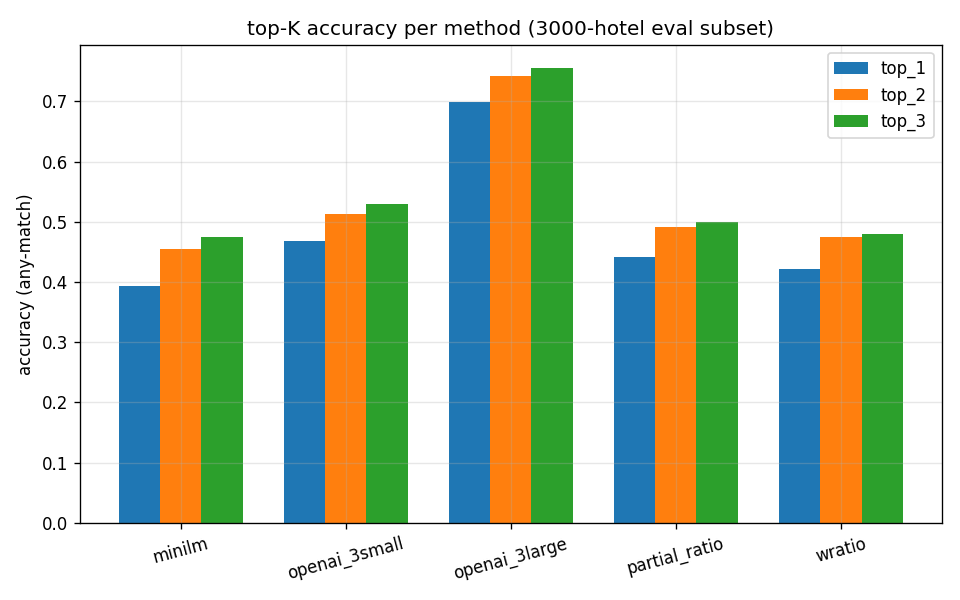

# Analytics — top-1 accuracy per method



Source: `runs/<method>/run1.json` (canonical) for minilm, openai_3small,
partial_ratio, wratio. `runs/openai_3large/run1.json` (unverified) for
openai_3large.

## Raw numbers

| method          | top_1  | top_2  | top_3  |
|-----------------|-------:|-------:|-------:|
| minilm          | 0.3937 | 0.4543 | 0.4740 |
| openai_3small   | 0.4687 | 0.5137 | 0.5297 |
| openai_3large * | 0.6981 | 0.7423 | 0.7560 |
| partial_ratio   | 0.4407 | 0.4913 | 0.4997 |
| wratio          | 0.4223 | 0.4740 | 0.4803 |

\* openai_3large: **unverified — see notes/slack_embeddings_thread.md**.
Jordan's run reported 0.698 top-1 but Mei's spot-checks on 2025-09-04
found the embeddings are row-permuted relative to `hotel_names.json` /
`city_names.json`. Treat this row as suspicious until a re-embed
against the canonical index ordering confirms or refutes the number.

## ASCII rendering of the chart

```
top-1 per method (3k eval subset)
=================================

  minilm         ███████████████████████░░░░░░░░░░░░░░░░░░░░░░░░░░░░░░░░░░░░░  0.3937
  openai_3small  ████████████████████████████░░░░░░░░░░░░░░░░░░░░░░░░░░░░░░░░  0.4687
  openai_3large  █████████████████████████████████████████░░░░░░░░░░░░░░░░░░░  0.6981
  partial_ratio  ██████████████████████████░░░░░░░░░░░░░░░░░░░░░░░░░░░░░░░░░░  0.4407
  wratio         █████████████████████████░░░░░░░░░░░░░░░░░░░░░░░░░░░░░░░░░░░  0.4223

  (bars scaled to 1.00)
```

## What to take away

1. **Canonical top-1 ranking** (excluding the unverified 3-large):
   openai_3small (0.47) > partial_ratio (0.44) > wratio (0.42) >
   minilm (0.39).
2. **Top-3 preserves that ordering** but the gaps shrink — partial_ratio
   is only 3 pp behind openai_3small at top-3.
3. **The 3-large outlier.** A 22pp step change over 3-small is
   implausible given that both are OpenAI embedding models trained on
   similar corpora. When a result looks too good, the first hypothesis
   should be "something is wrong with the measurement", not "the
   method is that much better".
4. **Fuzzy is competitive.** At top-3, partial_ratio is within 3 pp of
   openai_3small at zero API cost. Depending on product tolerance, a
   fuzzy-only stack is not crazy.
